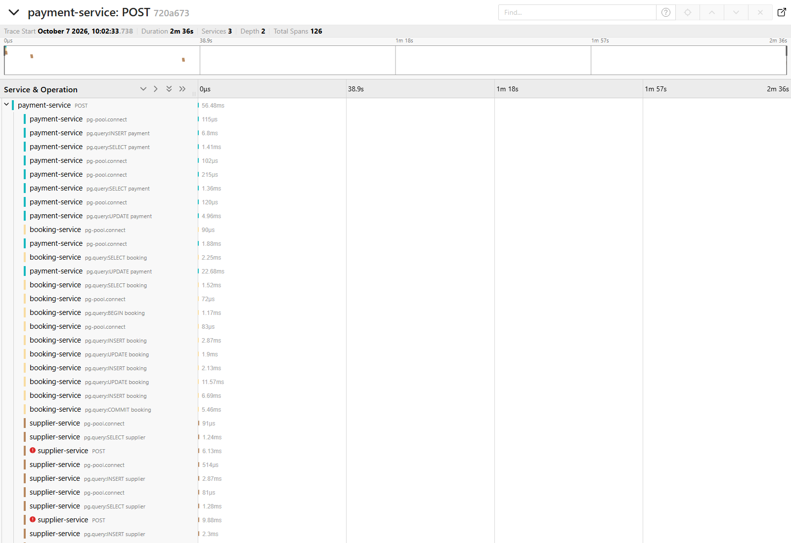
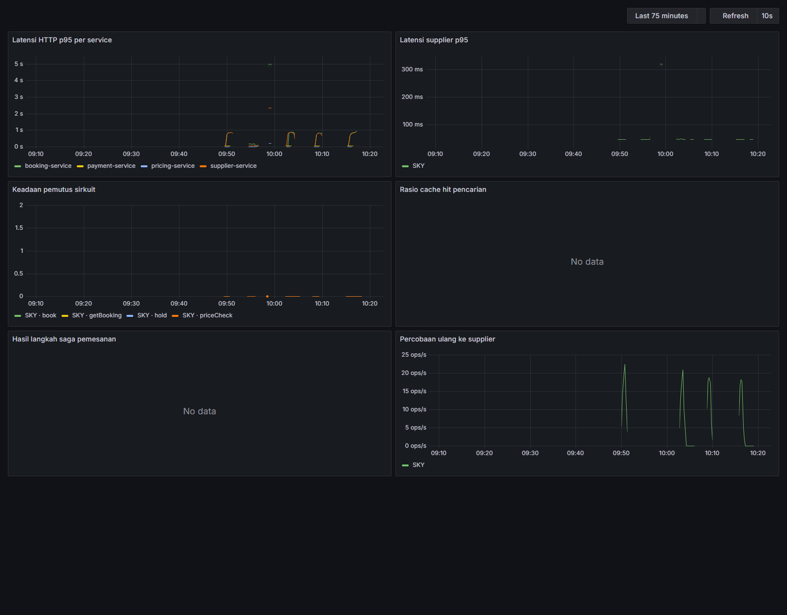

# Bukti konkurensi pemesanan

Metrik M5 dan M6 pada [PRD Bab 7.1](../../.claude/prds/travel-booking-engine.prd.md), US-04 dan US-05.

> **Status: DIUKUR**, 7 Oktober 2026, di satu laptop pengembang.
>
> Keempat skenario lulus seluruh pemeriksaannya pada jalan terakhir. Angka latensi di bawah adalah angka mesin ini — Windows, Intel i5-10300H, 24 GB, dengan Postgres, Redis, Kafka, RabbitMQ, supplier tiruan, **dan k6 sendiri** berjalan di mesin yang sama. Mereka membuktikan kebenaran (tidak ada kamar terjual dua kali, tidak ada uang tertahan), bukan kapasitas.
>
> Tiga hal belum terbukti dan ditulis terpisah di [bagian akhir](#yang-belum-terbukti).

## Ringkasan

| ID  | Metrik                                                        | Target | Hasil                                                                   |
| --- | ------------------------------------------------------------- | ------ | ----------------------------------------------------------------------- |
| M5  | Pemesanan ganda pada 1.000 permintaan serentak untuk 10 kamar | 0      | **0** — tepat 10 CONFIRMED, 990 ditolak, supplier mencatat 10 yang sama |
| M6  | Pembayaran berhasil tanpa pemesanan terkonfirmasi atau refund | 0      | **0** pada tiga skenario; **19 ditinjau manusia** pada skenario keempat |

Baris M6 tidak dibulatkan menjadi "0". Pada skenario supplier mati, 19 pembayaran berakhir di `NEEDS_REVIEW`: uangnya tidak hilang dan tidak terlupa, tetapi juga belum terkonfirmasi maupun dikembalikan. Itu perilaku yang disengaja (US-05) dan dijelaskan di [skenario 3](#3-supplier-mati-di-tengah-beban).

## Cara menjalankan

```bash
pnpm loadtest:booking booking-contention
pnpm loadtest:booking booking-idempotency
pnpm loadtest:booking booking-supplier-failure
pnpm loadtest:booking booking-supplier-refusal
```

Satu skenario per jalan. Setiap jalan menyalakan Postgres, Redis, Kafka, RabbitMQ, dan supplier tiruan lewat Testcontainers, membangun keempat service dari sumber, menjalankannya sebagai proses `node dist/index.js`, lalu menjalankan k6 dari kontainer `grafana/k6`. Yang dibutuhkan hanya Docker.

Supaya jalan beban terlihat di Grafana dan Jaeger, nyalakan keduanya lebih dulu (`pnpm infra:up`); tanpa itu hasilnya sama, hanya tidak terekam.

## Pemeriksaan sesudah setiap jalan

k6 hanya tahu jawaban HTTP. Kebenarannya diperiksa `tests/saga/load/verify.ts` **setelah seluruh saga tuntas**, langsung ke basis data booking-service, basis data payment-service, Redis, dan buku pemesanan supplier tiruan. Uji gagal bila satu saja tidak terpenuhi.

| Pemeriksaan                                             | Yang dibaca                                                         |
| ------------------------------------------------------- | ------------------------------------------------------------------- |
| CONFIRMED sama dengan ketersediaan awal                 | `bookings`                                                          |
| Tidak ada booking reference supplier yang ganda         | `bookings.supplier_ref`                                             |
| Setiap pembayaran berhasil terkonfirmasi atau direfund  | `payments`, `refunds`, `bookings` — lintas dua basis data           |
| Tidak ada pemesanan berhenti sambil memegang kamar/uang | `bookings` berstatus HELD, PAID, FAILED                             |
| Tidak ada hold yatim                                    | Redis dan daftar hold supplier                                      |
| Pemesanan di supplier cocok dengan CONFIRMED            | buku supplier vs `bookings` — pemesanannya sama, bukan hanya jumlah |
| Satu pemesanan per kunci, satu pembayaran per pemesanan | hanya skenario idempotensi                                          |

Pemeriksaan keenam yang paling jarang dilakukan dan paling meyakinkan: ia membuktikan tidak ada pemesanan bayangan di sisi supplier — kamar yang terjual tanpa tercatat di sistem kita.

## Hasil

Laporan mentah setiap skenario ada di [`booking-concurrency/`](booking-concurrency/).

### 1. Rebutan — 1.000 pengguna, 10 kamar (US-04, M5)

Setiap pengguna memverifikasi harga lebih dulu, lalu **seluruhnya menahan kamar dalam jendela satu detik**. Yang menang membayar.

| Ukuran                       | Hasil                       |
| ---------------------------- | --------------------------- |
| Hold berhasil                | 10                          |
| Hold ditolak "habis"         | 990                         |
| Pemesanan CONFIRMED          | **10**                      |
| Pemesanan di supplier        | 10, cocok satu per satu     |
| Booking reference ganda      | 0                           |
| Hold yatim (Redis, supplier) | 0                           |
| Bayar → terkonfirmasi        | p50 191 ms, p95 481 ms      |
| **Latensi hold p95**         | **5.200 ms** (p99 5.220 ms) |

Latensi hold itu buruk, dan sengaja tidak disembunyikan. Seribu hold dalam satu detik masing-masing memulai transaksi basis data lebih dari sekali, sementara kolam koneksinya 20: jawaban "habis" pun mengantre di belakang kolam itu. Pada tiga jalan terakhir angkanya 7.772, 8.181, dan 5.200 ms. Kebenarannya tidak terpengaruh — tepat sepuluh pada ketiganya — tetapi 990 pengguna menunggu lima sampai delapan detik hanya untuk diberi tahu kamarnya habis. Lihat [utang](#utang-yang-ditemukan).

### 2. Idempotensi — 50 kunci × 10 salinan serentak (FR-18)

Setiap pemesanan logis dikirim sepuluh kali sekaligus dengan pengguna dan kunci idempotensi yang sama: klik ganda, tab ganda, klien yang mengulang. Setiap salinan menjalankan seluruh alur. Notifikasi pembayaran dikirim dua kali dengan `transaction_id` yang sama.

| Ukuran                            | Hasil                       |
| --------------------------------- | --------------------------- |
| Permintaan dikirim                | 500 alur, 2.774 permintaan  |
| Pemesanan                         | **50** — satu per kunci     |
| Pembayaran                        | **50** — satu per pemesanan |
| Hold ke supplier                  | **50** — tidak ada terbuang |
| Pemesanan CONFIRMED               | 50                          |
| Kunci dengan pemesanan ganda      | 0                           |
| Pemesanan dengan pembayaran ganda | 0                           |
| Bayar → terkonfirmasi             | p50 885 ms, p95 1.741 ms    |

Angka "hold ke supplier 50" dihitung dari log supplier-service pada jalan 6 Oktober: tepat 50 panggilan hold untuk 50 pemesanan, sementara ke-500 salinan akhirnya menerima jawaban hold yang sama.

### 3. Supplier mati di tengah beban

Dua pemesanan per detik selama 60 detik; pengguna butuh 0–20 detik untuk membayar. Di detik ke-30 supplier **menerima koneksi lalu memutusnya**.

| Ukuran                                        | Hasil                   |
| --------------------------------------------- | ----------------------- |
| Alur dimulai                                  | 120                     |
| Berhenti di price check (supplier sudah mati) | 61 — tetap DRAFT        |
| CONFIRMED                                     | 40                      |
| **NEEDS_REVIEW**                              | **19**                  |
| Direfund                                      | 0                       |
| Pembayaran berhasil                           | 59 = 40 + 19            |
| Pemesanan di supplier                         | 40, cocok satu per satu |
| Latensi hold p95                              | 65 ms                   |
| Bayar → terkonfirmasi                         | p50 100 ms, p95 154 ms  |

Sembilan belas pemesanan dibayar setelah supplier mati. Koneksi yang putus setelah terbentuk **tidak membuktikan** supplier tidak mengerjakannya, jadi sistem tidak mengembalikan dana secara buta: refund untuk pemesanan yang ternyata terbentuk berarti platform membayar kamar yang uangnya sudah dikembalikan. Kesembilan belasnya diserahkan ke manusia dengan alasan yang sama, `status pemesanan di supplier tidak dapat dipastikan: upstream_error`.

Pada jalan ini supplier tiruan memang tidak menyimpan satu pun dari sembilan belas itu (40 di supplier, 40 di kita), jadi seluruhnya sebenarnya aman direfund. Sistem tidak dapat mengetahuinya dari tempatnya berdiri — rekonsiliasi Step 28 yang menutupnya.

### 4. Supplier menolak di tengah beban — jalur kompensasi (US-03, M6)

Beban yang sama, tetapi di detik ke-30 supplier menjawab **503 untuk setiap permintaan**. Jawaban 503 adalah kepastian bahwa permintaannya tidak dikerjakan.

| Ukuran                               | Hasil                                         |
| ------------------------------------ | --------------------------------------------- |
| Alur dimulai                         | 121                                           |
| Berhenti di price check              | 61 — tetap DRAFT                              |
| CONFIRMED                            | 36                                            |
| **REFUNDED**                         | **24**                                        |
| NEEDS_REVIEW                         | 0                                             |
| Pembayaran berhasil                  | 60 = 36 + 24                                  |
| Pemesanan di supplier                | 36 — tidak satu pun yang direfund ada di sana |
| Saga menyatakan gagal → dana kembali | p50 111 ms, p95 159 ms                        |
| **Pengguna membayar → dana kembali** | **p50 155,4 detik**, p95 155,5 detik          |

Dua baris terakhir mengukur hal yang berbeda, dan hanya menyebut yang pertama akan menyesatkan. Refundnya sendiri selesai dalam seperdelapan detik. Tetapi sebelum saga boleh menyatakan gagal, perintah konfirmasinya dicoba sepanjang jenjang retry RabbitMQ — 5, 30, lalu 120 detik — jadi uang pengguna tertahan dua setengah menit. Itu harga dari tidak menyerah terlalu cepat pada supplier yang mungkin hanya tersendat.

## Trace satu alur kompensasi

Trace `720a6732af3d513c2047f9faba623a6a`, dari skenario 4. Berkas mentahnya: [`trace-kompensasi-…json`](booking-concurrency/trace-kompensasi-720a6732af3d513c2047f9faba623a6a.json). Dari berkas itu tujuh tag proses dibuang sebelum disimpan — nama host, pengenal mesin, nama pengguna, PID, dan path lokal — karena tidak menjelaskan apa pun tentang sistemnya; seluruh span dan tag span-nya utuh.



Tangkapan layarnya hanya memuat awal trace; 126 span tidak muat di satu layar. Garis waktu di bawah diambil dari berkas mentah yang sama, tanpa span basis data:

```
   0,00 dtk  payment-service   POST /webhooks/midtrans        200   notifikasi pembayaran diterima
   0,14 dtk  supplier-service  POST /sky/bookings             503   ┐
   0,18 dtk  supplier-service  POST /sky/bookings             503   │ pengiriman pertama, tiga percobaan
   0,21 dtk  supplier-service  POST /sky/bookings             503   ┘
   5,24 dtk  supplier-service  POST /sky/bookings             503   ┐
   5,28 dtk  supplier-service  POST /sky/bookings             503   │ jenjang retry 5 detik
   5,31 dtk  supplier-service  POST /sky/bookings             503   ┘
  35,40 dtk  supplier-service  POST /sky/bookings             503   ┐
  35,42 dtk  supplier-service  POST /sky/bookings             503   │ jenjang retry 30 detik
  35,44 dtk  supplier-service  POST /sky/bookings             503   ┘
 155,45 dtk  supplier-service  POST /sky/bookings             503   ┐
 155,47 dtk  supplier-service  POST /sky/bookings             503   │ jenjang retry 120 detik
 155,48 dtk  supplier-service  POST /sky/bookings             503   ┘
 155,58 dtk  payment-service   POST …/refund                  200   dana dikembalikan
```

Satu trace melintasi tiga service dan dua perantara pesan: pembayaran masuk lewat HTTP, `payment.succeeded` lewat Kafka ke booking-service, perintah `supplier.confirm` lewat RabbitMQ ke supplier-service, penolakannya kembali lewat Kafka, lalu perintah `payment.refund` lewat RabbitMQ ke payment-service. Konteks trace ikut terbawa di setiap perpindahan. Yang tidak tampak sebagai span adalah perpindahan pesannya sendiri: hanya HTTP dan basis data yang diinstrumentasi.

## Grafana



Empat panel berisi data dari jalan 7 Oktober: latensi HTTP per service, latensi supplier, keadaan pemutus sirkuit, dan percobaan ulang ke supplier (lonjakan-lonjakannya adalah jalan beban). Dua panel kosong, dan keduanya dibiarkan terlihat:

- **Rasio cache hit pencarian** — search-service tidak ikut dalam uji ini.
- **Hasil langkah saga pemesanan** — panelnya ada, metriknya tidak. booking-service belum mengekspor apa pun tentang langkah saga. Lihat [utang](#utang-yang-ditemukan).

## Cacat yang ditemukan uji beban ini

Tidak satu pun dari kelimanya terlihat oleh uji unit maupun uji integrasi yang sudah hijau.

1. **Price check kembar membatalkan hold yang sedang berjalan.** Permintaan dengan kunci idempotensi yang sama menjalankan price check ulang, dan price check ulang menaikkan versi pemesanan walau harganya sama. Hold yang sedang menunggu supplier lalu kalah kunci versi, dibatalkan, dan dikompensasi — kursi dan hold supplier terbuang untuk harga yang tidak berubah — sementara pemanggilnya dijawab "sedang diproses" padahal tidak ada lagi yang memprosesnya. Pada jalan pertama skenario idempotensi, sembilan dari sepuluh kunci berakhir tanpa hold sama sekali. Diperbaiki di `place-hold.ts`: commit HELD dibaca ulang dan diulang paling banyak tiga kali, dan tetap batal bila harganya berubah, pemesanannya tidak lagi menunggu hold, atau saganya sudah diambil alih pemulih.
2. **Skenario idempotensi sendiri menggagalkan dirinya.** Salinan yang dijawab "sedang diproses" berhenti, sehingga kadang tidak ada salinan yang membayar dan pemesanannya kedaluwarsa. Klien sungguhan bertanya lagi; skenarionya sekarang juga.
3. **Skenario supplier mati tidak pernah menyentuh kegagalannya.** Tanpa jeda membayar, seluruh alur selesai dalam satu detik dan tidak ada pemesanan yang berada di antara hold dan konfirmasi saat supplier mati. Jalan pertamanya lulus dengan nol refund dan nol peninjauan.
4. **Pembayaran yang dibuka terlalu cepat ditolak.** payment-service mengetahui harga dari peristiwa Kafka, dan pembayaran yang dibuka sepersekian detik setelah hold dapat mendahuluinya: 12 dari 58 pemesanan ditolak pada percobaan pertama. Sistem menjawab 503 "coba lagi sebentar" sesuai rancangan, tetapi skenarionya tidak mengulang dan angkanya terbaca seperti akibat supplier mati. Dengan jeda membayar yang wajar, pengulangan itu paling banyak terjadi sekali per jalan pada empat jalan terakhir.
5. **Nama pemeriksaan menjanjikan lebih dari isinya.** "Tidak ada pemesanan tertinggal di keadaan tidak final" lulus dengan 990 `PRICE_CHECKED` dan 62 `DRAFT` di tabel. Namanya diganti menjadi yang benar-benar diperiksa, dan jumlah pemesanan pra-hold sekarang dilaporkan di setiap jalan.

## Utang yang ditemukan

- **Latensi hold di bawah lonjakan.** Lima sampai delapan detik pada p95 saat seribu hold tiba dalam satu detik. Penolakan "habis" seharusnya murah; sekarang ia membayar dua transaksi basis data lebih dulu.
- **Pemesanan pra-hold tidak pernah dibersihkan.** `DRAFT` dan `PRICE_CHECKED` yang ditinggalkan tidak memegang kamar maupun uang, tetapi juga tidak pernah berakhir. Definisi Selesai Step 22 menyebut "tidak ada pemesanan tertinggal di keadaan tidak final"; secara harfiah itu **tidak terpenuhi**.
- **Tidak ada metrik saga.** Panel Grafana untuk hasil langkah saga kosong karena metriknya tidak pernah diekspor.

## Yang belum terbukti

- **Proses Node mati tanpa pesan.** Selama dua hari pengukuran, lima kali sebuah proses Node keluar dengan kode `3221226505` (`0xC0000409`) tanpa keluaran apa pun: dua kali pelari uji, dua kali booking-service, sekali supplier-service — dua di antaranya sekitar satu detik setelah service menyatakan siap, sebelum ada beban. Yang sudah disingkirkan lewat pengukuran: bukan kehabisan memori (crash terjadi dengan 1,3 GB commit tersisa, sementara jalan lain lulus dengan 349 MB), bukan galat fatal V8 (laporan diagnostik Node aktif dan tidak menghasilkan apa pun), bukan perlindungan shadow stack (mati, dan prosesornya tidak mendukung), dan service-nya tidak memuat modul native. Penyebabnya **tidak diketahui**. Mesinnya memakai Windows build Insider, dan uji ini belum pernah dijalankan di Linux. Setiap jalan yang dilaporkan di atas adalah jalan tanpa kematian proses; jalan yang terkena dibuang dan diulang, dan pelari uji sekarang gagal seketika dengan nama service dan kode keluarnya.
- **Setiap pemeriksaan terbukti dapat gagal.** Hanya pemeriksaan M5 yang pernah terlihat menggagalkan jalan sungguhan (lima kali, dengan 0, 1, dan 9 CONFIRMED). Enam lainnya belum pernah terlihat gagal di pelari beban.
- **Di luar satu mesin.** Satu instance per service. Jaminan US-04 dirancang untuk beberapa instance booking-service di atas Redis yang sama; itu belum diuji.

## Riwayat jalan

Dua puluh jalan menghasilkan laporan selama dua hari:

| Skenario         | Lulus | Gagal | Catatan                                                                                                                                                                       |
| ---------------- | ----- | ----- | ----------------------------------------------------------------------------------------------------------------------------------------------------------------------------- |
| Rebutan          | 8     | 2     | jalan pertama hanya 50 pengguna; dua kegagalan (9 dan 1 CONFIRMED) pada 6 Oktober, sebelum kolam koneksi dan penanganan "basis data sibuk" disetel; tiga jalan terakhir lulus |
| Idempotensi      | 2     | 3     | tiga kegagalan adalah cacat nomor 1 dan 2 di atas                                                                                                                             |
| Supplier mati    | 3     | 0     | jalan pertama lulus tanpa menguji apa pun — cacat nomor 3                                                                                                                     |
| Supplier menolak | 2     | 0     |                                                                                                                                                                               |

Lima jalan lain kandas karena kematian proses di atas dan tidak menghasilkan laporan.
